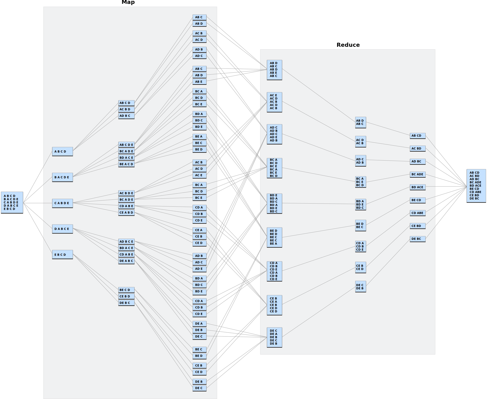

# Lab 1
## Part 1
### Problem:

Implement MapReduce algorithm for finding Facebook common friends problem and run the MapReduce job on Apache Hadoop.

**Finding Facebook common friends:** Facebook has a list of friends (note that friends are a bi-directional thing on Facebook. If I'm your friend, you're mine). They also have lots of disk space and they serve hundreds of millions of requests everyday. They've decided to pre-compute calculations when they can to reduce the processing time of requests. One common processing request is the "You and Joe have 230 friends in common" feature. When you visit someone's profile, you see a list of friends that you have in common. We're going to use MapReduce so that we can calculate everyone's common friends once a day and store those results. Later on it's just a quick lookup. We've got lots of disk, it's cheap.

**Example (What is the Key/Value Pair?)** 

Assume the friends are stored as Person->[List of Friends], our friends list is then:

> A -> B C D  
> B -> A C D E  
> C -> A B D E  
> D -> A B C E  
> E -> B C D

The result after reduction is:

> (A B) -> (C D)  
> (A C) -> (B D)  
> (A D) -> (B C)  
> (B C) -> (A D E)  
> (B D) -> (A C E)  
> (B E) -> (C D)  
> (C D) -> (A B E)  
> (C E) -> (B D)  
> (D E) -> (B C)  

When D visits B's profile, we can quickly look up (B D) and see that they have three friends in common, (A C E).

### Solution:

>1) asd  
>    2) asd  
>1) asd  
>1) asd  
