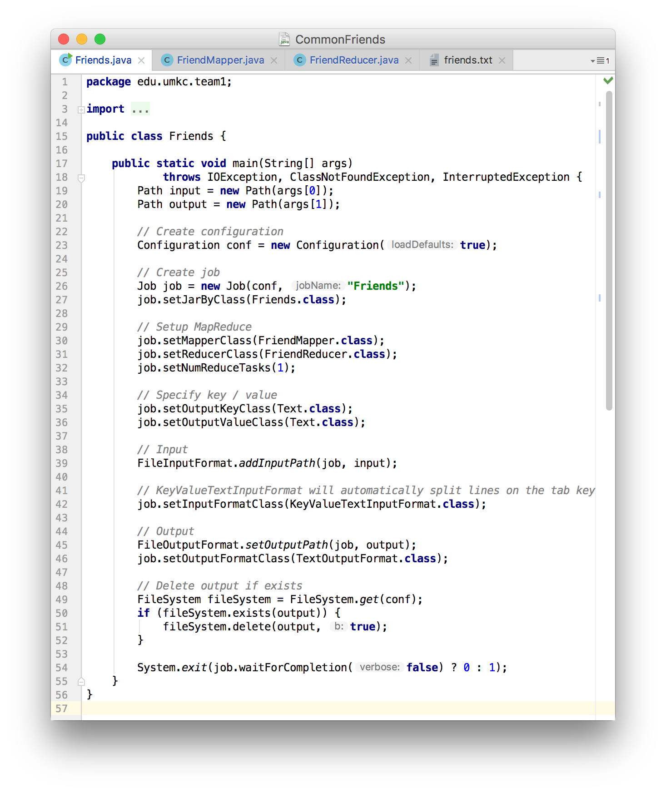
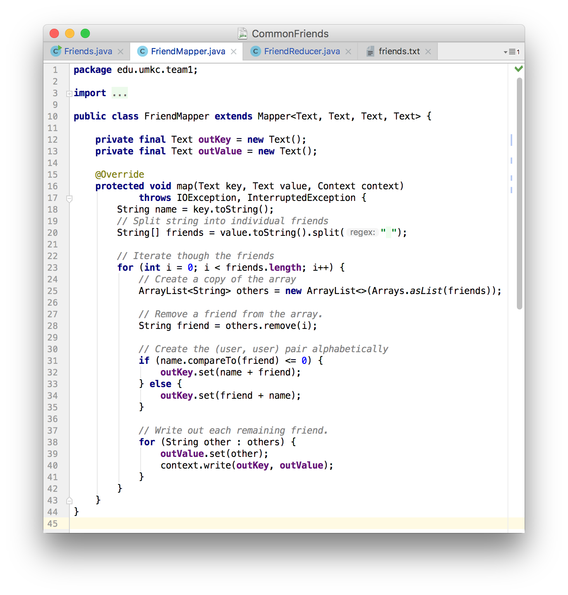
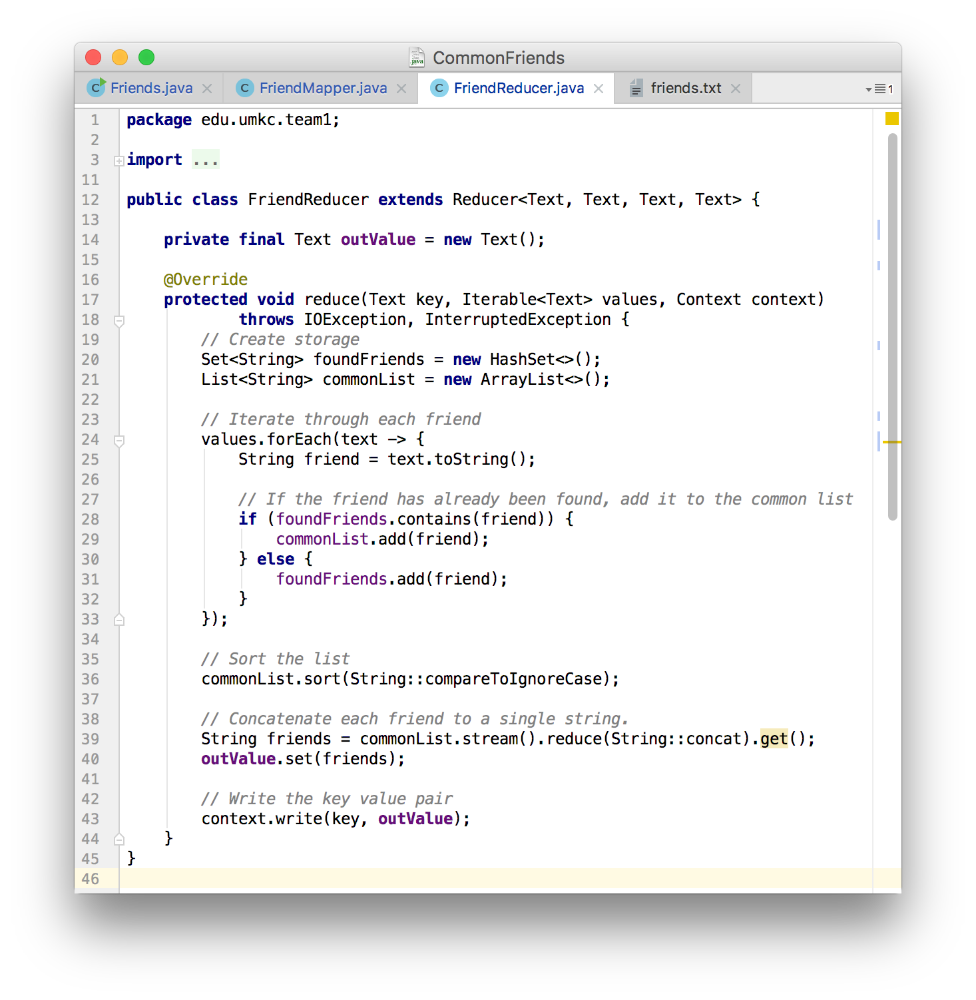
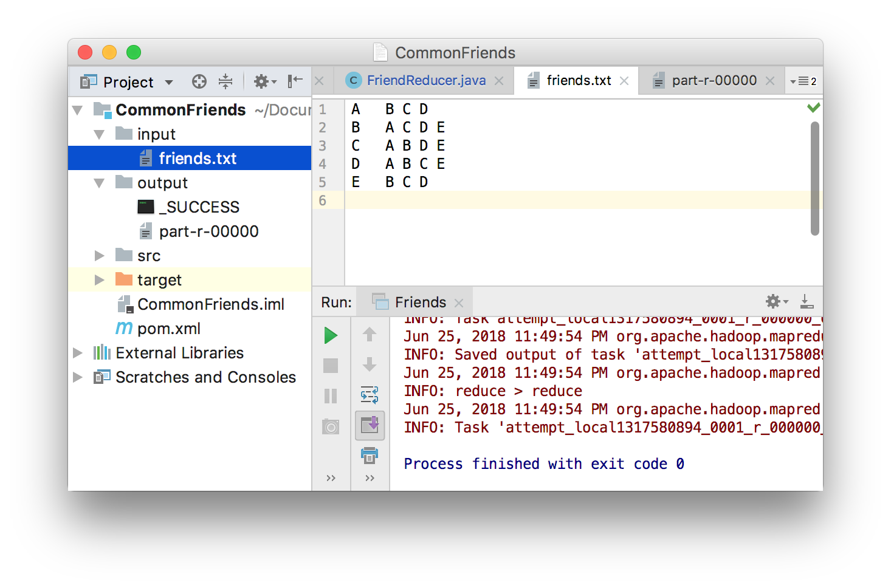
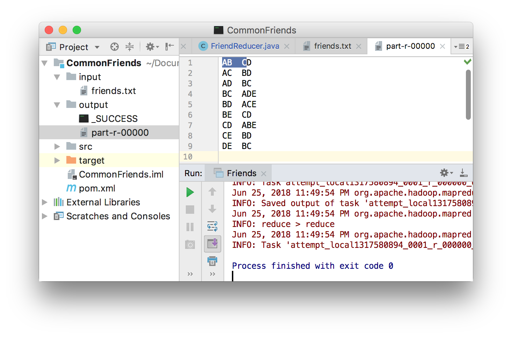
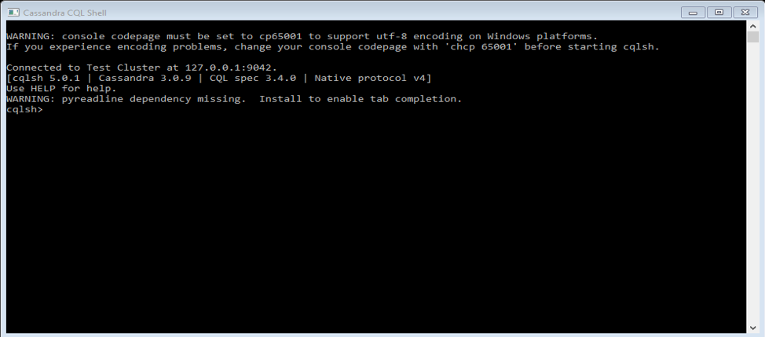
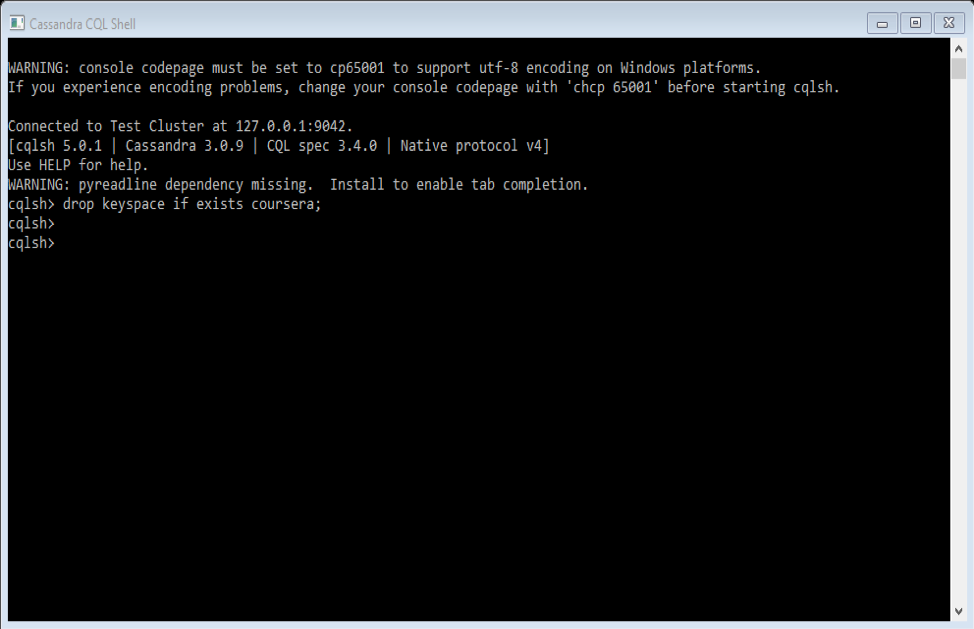
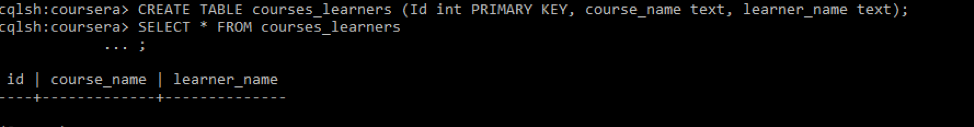
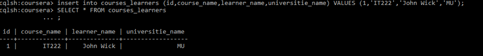
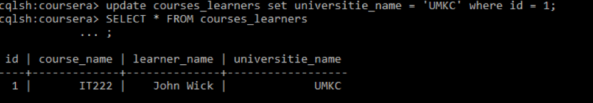

# Lab 1
## Part 1
### Problem:

Implement MapReduce algorithm for finding Facebook common friends problem and run the MapReduce job on Apache Hadoop.

**Finding Facebook common friends:** Facebook has a list of friends (note that friends are a bi-directional thing on Facebook. If I'm your friend, you're mine). They also have lots of disk space and they serve hundreds of millions of requests everyday. They've decided to pre-compute calculations when they can to reduce the processing time of requests. One common processing request is the "You and Joe have 230 friends in common" feature. When you visit someone's profile, you see a list of friends that you have in common. We're going to use MapReduce so that we can calculate everyone's common friends once a day and store those results. Later on it's just a quick lookup. We've got lots of disk, it's cheap.

**Example (What is the Key/Value Pair?)** 

Assume the friends are stored as Person->[List of Friends], our friends list is then:

> A -> B C D  
> B -> A C D E  
> C -> A B D E  
> D -> A B C E  
> E -> B C D

The result after reduction is:

> (A B) -> (C D)  
> (A C) -> (B D)  
> (A D) -> (B C)  
> (B C) -> (A D E)  
> (B D) -> (A C E)  
> (B E) -> (C D)  
> (C D) -> (A B E)  
> (C E) -> (B D)  
> (D E) -> (B C)  

When D visits B's profile, we can quickly look up (B D) and see that they have three friends in common, (A C E).

### Solution:

The class `Friends` sets up the Mapper and Reducer and contains the program's `main` function.

Input comes into the mapper as `key`-`value` pairs; `key` represents a user, and `value` represents a list of their friends. 

> A -> B C D

A new `key` is created by combining the user with a friend (alphabetically).

> A B  
> A C  
> A D  

The value is each remaining friend.

> A B -> C  
> A B -> D  
> A C -> B  
> A C -> D  
> A D -> B  
> A D -> C

The reducer will then iterate through the new keys.

> A B -> C D C D E

If a friend is found twice, then it was found to be in common.

> A B -> C D

Runing the program will load the contents of the `input` directory.

The results of the map/reduce operation is saved to the `output` directory.

## Part 2 
### Category: Product Catalogs and Playlists 

#### Coursera

Coursera is an education platform which partners with top universities and organization worldwide, to offer courses online for anyone to take, for free. From our assumptions Coursera want to create database that best to keep their online class catalogs. First, they try to use the standard MySQL database, they create table with the Primary Key, and the Foreign Keys.  But this approach was insufficient because the database was unstable perform, unexpected downtime and database has limitation in introducing new features. The best way to fix this database is was to use Cassandra because Cassandra is next generation Database, it has easy replication supports, it has no simple point of failure, scalable and high availability for the end user. Coursera has the ability to operate on low latency servers so its not going to have unstable performance and unexpected downtime when dealing with Coursera big database of class categories and playlist. Last challenge for the Coursera was the limitation in introducing new features. The Cassandra is open source so it has no limitation in inducing new features. All the Coursera challengers can be solved by using Cassandra database. From the instructions below person can see how easy to change the database from example 6 and example 8. For the example 6, new columns add to the database and the example 8 show the change the data in the columns.

#### Instructions

1. First thing is open Cassandra CQL Shell

	

2. Before creating keystone, we have to make sure the keystone does not exist

	

3. Then we create the keystone called coursera 

	 

4. After that we can just type ‘use’ to use coursera keyspace 

	 

5. Inside of the keystone we can create table with all the data we need and check if data is successfully created 

	 
	
6. Adding extra data to the database, like adding extra columns.
  
	
	
7.  Adding the data to the columns 
 
	
	
8. Change the database inside of the columns 

	
