# Lab 2

YouTube Video Link: [Lab2 Part 1 and 2](https://www.youtube.com/watch?v=cLmmAJTE0vA)

## Part 1: HIVE USE-CASE

We are going to use the [Superhero Dataset](https://www.kaggle.com/claudiodavi/superhero-set/data) with Hive.

First, run the Hive command line tool from the terminal:

```Shell
hive
```

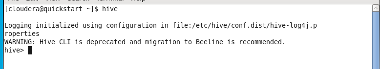

Then create a database called `hero`:

```HiveQL
CREATE DATABASE hero;
```


Then use the `hero` database:

```HiveQL
USE hero;
```


Now create a `superheros` table:

```HiveQL
CREATE TABLE superheros (
	id INT,
	name STRING,
	gender STRING,
	eye_color STRING,
	race STRING,
	hair_color STRING,
	height FLOAT,
	publisher STRING,
	skin_color STRING,
	alignment STRING,
	weight FLOAT
) ROW FORMAT DELIMITED FIELDS TERMINATED BY ',';
```

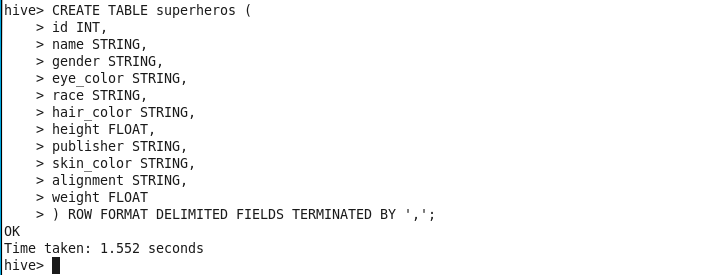

To see the table use this code:

```HiveQL
DESCRIBE superheros;
```

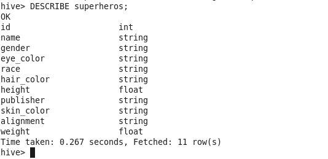

Then load the data from a local file:

```HiveQL
LOAD DATA LOCAL INPATH '/home/cloudera/Desktop/Lab2/Heros' INTO TABLE superheros;
```

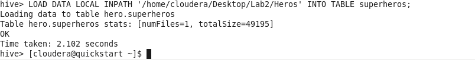

Verify that the data was entered by querying the table:

```HiveQL
SELECT * FROM superheros;
```


We can now restructure the data using Complex Data Types; we will use structs to group similar attributes into color and size. Start by creating a new table, `superheros2`:

```HiveQL
CREATE TABLE superheros2 (
	id INT,
	name STRING,
	gender STRING,
	race STRING,
	color STRUCT<hair: STRING,
		eye: STRING,
		skin: STRING>,
	size STRUCT<height: FLOAT,
		weight: FLOAT>,
	publisher STRING,
	alignment STRING
) ROW FORMAT DELIMITED
FIELDS TERMINATED BY '\t'
COLLECTION ITEMS TERMINATED BY ',';
```

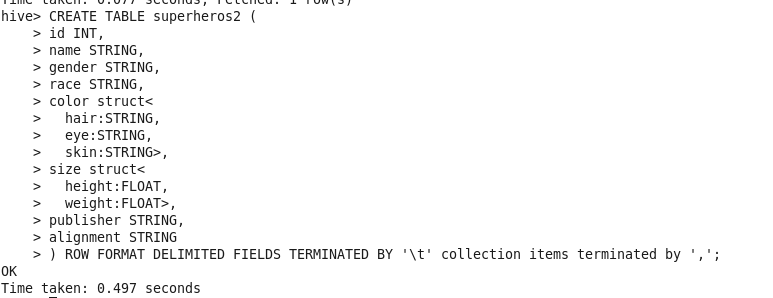

To see the `superheros2` table use this:

```HiveQL
DESCRIBE superheros2;
```

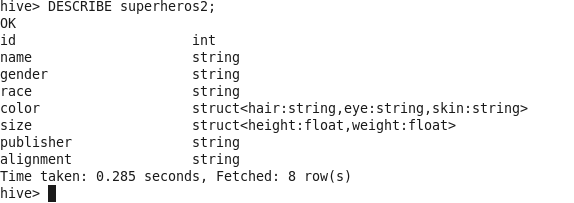

After we done loading the Super Hero tables then we have to load the Super Powers:

```HiveQL
CREATE TABLE superpowers (
	hero_names STRING,
	`Agility` BOOLEAN,
	`Accelerated Healing` BOOLEAN,
	`Lantern Power Ring` BOOLEAN,
	`Dimensional Awareness` BOOLEAN,
	`Cold Resistance` BOOLEAN,
	`Durability` BOOLEAN,
	`Stealth` BOOLEAN,
	`Energy Absorption` BOOLEAN,
	`Flight` BOOLEAN,
	`Danger Sense` BOOLEAN,
	`Underwater breathing` BOOLEAN,
	`Marksmanship` BOOLEAN,
	`Weapons Master` BOOLEAN,
	`Power Augmentation` BOOLEAN,
	`Animal Attributes` BOOLEAN,
	`Longevity` BOOLEAN,
	`Intelligence` BOOLEAN,
	`Super Strength` BOOLEAN,
	`Cryokinesis` BOOLEAN,
	`Telepathy` BOOLEAN,
	`Energy Armor` BOOLEAN,
	`Energy Blasts` BOOLEAN,
	`Duplication` BOOLEAN,
	`Size Changing` BOOLEAN,
	`Density Control` BOOLEAN,
	`Stamina` BOOLEAN,
	`Astral Travel` BOOLEAN,
	`Audio Control` BOOLEAN,
	`Dexterity` BOOLEAN,
	`Omnitrix` BOOLEAN,
	`Super Speed` BOOLEAN,
	`Possession` BOOLEAN,
	`Animal Oriented Powers` BOOLEAN,
	`Weapon-based Powers` BOOLEAN,
	`Electrokinesis` BOOLEAN,
	`Darkforce Manipulation` BOOLEAN,
	`Death Touch` BOOLEAN,
	`Teleportation` BOOLEAN,
	`Enhanced Senses` BOOLEAN,
	`Telekinesis` BOOLEAN,
	`Energy Beams` BOOLEAN,
	`Magic` BOOLEAN,
	`Hyperkinesis` BOOLEAN,
	`Jump` BOOLEAN,
	`Clairvoyance` BOOLEAN,
	`Dimensional Travel` BOOLEAN,
	`Power Sense` BOOLEAN,
	`Shapeshifting` BOOLEAN,
	`Peak Human Condition` BOOLEAN,
	`Immortality` BOOLEAN,
	`Camouflage` BOOLEAN,
	`Element Control` BOOLEAN,
	`Phasing` BOOLEAN,
	`Astral Projection` BOOLEAN,
	`Electrical Transport` BOOLEAN,
	`Fire Control` BOOLEAN,
	`Projection` BOOLEAN,
	`Summoning` BOOLEAN,
	`Enhanced Memory` BOOLEAN,
	`Reflexes` BOOLEAN,
	`Invulnerability` BOOLEAN,
	`Energy Constructs` BOOLEAN,
	`Force Fields` BOOLEAN,
	`Self-Sustenance` BOOLEAN,
	`Anti-Gravity` BOOLEAN,
	`Empathy` BOOLEAN,
	`Power Nullifier` BOOLEAN,
	`Radiation Control` BOOLEAN,
	`Psionic Powers` BOOLEAN,
	`Elasticity` BOOLEAN,
	`Substance Secretion` BOOLEAN,
	`Elemental Transmogrification` BOOLEAN,
	`Technopath/Cyberpath` BOOLEAN,
	`Photographic Reflexes` BOOLEAN,
	`Seismic Power` BOOLEAN,
	`Animation` BOOLEAN,
	`Precognition` BOOLEAN,
	`Mind Control` BOOLEAN,
	`Fire Resistance` BOOLEAN,
	`Power Absorption` BOOLEAN,
	`Enhanced Hearing` BOOLEAN,
	`Nova Force` BOOLEAN,
	`Insanity` BOOLEAN,
	`Hypnokinesis` BOOLEAN,
	`Animal Control` BOOLEAN,
	`Natural Armor` BOOLEAN,
	`Intangibility` BOOLEAN,
	`Enhanced Sight` BOOLEAN,
	`Molecular Manipulation` BOOLEAN,
	`Heat Generation` BOOLEAN,
	`Adaptation` BOOLEAN,
	`Gliding` BOOLEAN,
	`Power Suit` BOOLEAN,
	`Mind Blast` BOOLEAN,
	`Probability Manipulation` BOOLEAN,
	`Gravity Control` BOOLEAN,
	`Regeneration` BOOLEAN,
	`Light Control` BOOLEAN,
	`Echolocation` BOOLEAN,
	`Levitation` BOOLEAN,
	`Toxin and Disease Control` BOOLEAN,
	`Banish` BOOLEAN,
	`Energy Manipulation` BOOLEAN,
	`Heat Resistance` BOOLEAN,
	`Natural Weapons` BOOLEAN,
	`Time Travel` BOOLEAN,
	`Enhanced Smell` BOOLEAN,
	`Illusions` BOOLEAN,
	`Thirstokinesis` BOOLEAN,
	`Hair Manipulation` BOOLEAN,
	`Illumination` BOOLEAN,
	`Omnipotent` BOOLEAN,
	`Cloaking` BOOLEAN,
	`Changing Armor` BOOLEAN,
	`Power Cosmic` BOOLEAN,
	`Biokinesis` BOOLEAN,
	`Water Control` BOOLEAN,
	`Radiation Immunity` BOOLEAN,
	`Vision - Telescopic` BOOLEAN,
	`Toxin and Disease Resistance` BOOLEAN,
	`Spatial Awareness` BOOLEAN,
	`Energy Resistance` BOOLEAN,
	`Telepathy Resistance` BOOLEAN,
	`Molecular Combustion` BOOLEAN,
	`Omnilingualism` BOOLEAN,
	`Portal Creation` BOOLEAN,
	`Magnetism` BOOLEAN,
	`Mind Control Resistance` BOOLEAN,
	`Plant Control` BOOLEAN,
	`Sonar` BOOLEAN,
	`Sonic Scream` BOOLEAN,
	`Time Manipulation` BOOLEAN,
	`Enhanced Touch` BOOLEAN,
	`Magic Resistance` BOOLEAN,
	`Invisibility` BOOLEAN,
	`Sub-Mariner` BOOLEAN,
	`Radiation Absorption` BOOLEAN,
	`Intuitive aptitude` BOOLEAN,
	`Vision - Microscopic` BOOLEAN,
	`Melting` BOOLEAN,
	`Wind Control` BOOLEAN,
	`Super Breath` BOOLEAN,
	`Wallcrawling` BOOLEAN,
	`Vision - Night` BOOLEAN,
	`Vision - Infrared` BOOLEAN,
	`Grim Reaping` BOOLEAN,
	`Matter Absorption` BOOLEAN,
	`The Force` BOOLEAN,
	`Resurrection` BOOLEAN,
	`Terrakinesis` BOOLEAN,
	`Vision - Heat` BOOLEAN,
	`Vitakinesis` BOOLEAN,
	`Radar Sense` BOOLEAN,
	`Qwardian Power Ring` BOOLEAN,
	`Weather Control` BOOLEAN,
	`Vision - X-Ray` BOOLEAN,
	`Vision - Thermal` BOOLEAN,
	`Web Creation` BOOLEAN,
	`Reality Warping` BOOLEAN,
	`Odin Force` BOOLEAN,
	`Symbiote Costume` BOOLEAN,
	`Speed Force` BOOLEAN,
	`Phoenix Force` BOOLEAN,
	`Molecular Dissipation` BOOLEAN,
	`Vision - Cryo` BOOLEAN,
	`Omnipresent` BOOLEAN,
	`Omniscient` BOOLEAN
) ROW FORMAT DELIMITED FIELDS TERMINATED BY ',';
```


To see the table:

```HiveQL
DESCRIBE superpowers;
```


Then load the data to the superpowers table:

```HiveQL
LOAD DATA LOCAL INPATH '/home/cloudera/Desktop/Lab2/Powers' INTO TABLE superpowers;
```

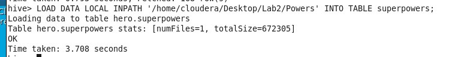

To see the table:

```HiveQL
SELECT * FROM superpowers;
```

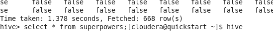

We had to use more then one complex data types, because of this we used array on the superpower table : because of this we create superpower2 table;

```HiveQL
CREATE TABLE superpowers2 (
	name STRING,
	powers ARRAY<STRING>
) ROW FORMAT DELIMITED
FIELDS TERMINATED BY '\t'
COLLECTION ITEMS TERMINATED BY ',';
```


To see the table :

```HiveQL
DESCRIBE superpowers2;
```


After creating the complex data types we have to enter the data to thus tables, first enter data to the `superheros2`:

```HiveQL
INSERT INTO TABLE superheros2
SELECT id, name, gender, race,
	named_struct('hair', hair_color,
		'eye', eye_color,
		'skin',
		skin_color) as color,
	named_struct('height', height,
		'weight', weight) as size,
	publisher, alignment
FROM superheros;
```

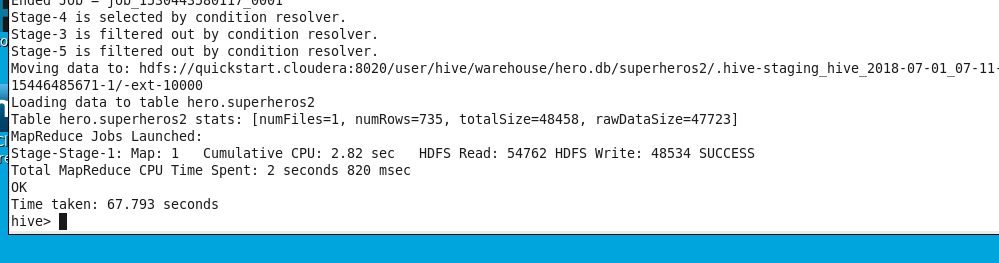

Then we insert the superpower2:

```HiveQL
INSERT INTO TABLE superpowers2
SELECT name, collect_set(power) powers
FROM (
	SELECT hero_names name, t2.key power
	FROM superpowers LATERAL VIEW explode (
		map('Agility', `Agility`,
		'Accelerated Healing', `Accelerated Healing`,
		'Lantern Power Ring', `Lantern Power Ring`,
		'Dimensional Awareness', `Dimensional Awareness`,
		'Cold Resistance', `Cold Resistance`,
		'Durability', `Durability`,
		'Stealth', `Stealth`,
		'Energy Absorption', `Energy Absorption`,
		'Flight', `Flight`,
		'Danger Sense', `Danger Sense`,
		'Underwater breathing', `Underwater breathing`,
		'Marksmanship', `Marksmanship`,
		'Weapons Master', `Weapons Master`,
		'Power Augmentation', `Power Augmentation`,
		'Animal Attributes', `Animal Attributes`,
		'Longevity', `Longevity`,
		'Intelligence', `Intelligence`,
		'Super Strength', `Super Strength`,
		'Cryokinesis', `Cryokinesis`,
		'Telepathy', `Telepathy`,
		'Energy Armor', `Energy Armor`,
		'Energy Blasts', `Energy Blasts`,
		'Duplication', `Duplication`,
		'Size Changing', `Size Changing`,
		'Density Control', `Density Control`,
		'Stamina', `Stamina`,
		'Astral Travel', `Astral Travel`,
		'Audio Control', `Audio Control`,
		'Dexterity', `Dexterity`,
		'Omnitrix', `Omnitrix`,
		'Super Speed', `Super Speed`,
		'Possession', `Possession`,
		'Animal Oriented Powers', `Animal Oriented Powers`,
		'Weapon-based Powers', `Weapon-based Powers`,
		'Electrokinesis', `Electrokinesis`,
		'Darkforce Manipulation', `Darkforce Manipulation`,
		'Death Touch', `Death Touch`,
		'Teleportation', `Teleportation`,
		'Enhanced Senses', `Enhanced Senses`,
		'Telekinesis', `Telekinesis`,
		'Energy Beams', `Energy Beams`,
		'Magic', `Magic`,
		'Hyperkinesis', `Hyperkinesis`,
		'Jump', `Jump`,
		'Clairvoyance', `Clairvoyance`,
		'Dimensional Travel', `Dimensional Travel`,
		'Power Sense', `Power Sense`,
		'Shapeshifting', `Shapeshifting`,
		'Peak Human Condition', `Peak Human Condition`,
		'Immortality', `Immortality`,
		'Camouflage', `Camouflage`,
		'Element Control', `Element Control`,
		'Phasing', `Phasing`,
		'Astral Projection', `Astral Projection`,
		'Electrical Transport', `Electrical Transport`,
		'Fire Control', `Fire Control`,
		'Projection', `Projection`,
		'Summoning', `Summoning`,
		'Enhanced Memory', `Enhanced Memory`,
		'Reflexes', `Reflexes`,
		'Invulnerability', `Invulnerability`,
		'Energy Constructs', `Energy Constructs`,
		'Force Fields', `Force Fields`,
		'Self-Sustenance', `Self-Sustenance`,
		'Anti-Gravity', `Anti-Gravity`,
		'Empathy', `Empathy`,
		'Power Nullifier', `Power Nullifier`,
		'Radiation Control', `Radiation Control`,
		'Psionic Powers', `Psionic Powers`,
		'Elasticity', `Elasticity`,
		'Substance Secretion', `Substance Secretion`,
		'Elemental Transmogrification', `Elemental Transmogrification`,
		'Technopath/Cyberpath', `Technopath/Cyberpath`,
		'Photographic Reflexes', `Photographic Reflexes`,
		'Seismic Power', `Seismic Power`,
		'Animation', `Animation`,
		'Precognition', `Precognition`,
		'Mind Control', `Mind Control`,
		'Fire Resistance', `Fire Resistance`,
		'Power Absorption', `Power Absorption`,
		'Enhanced Hearing', `Enhanced Hearing`,
		'Nova Force', `Nova Force`,
		'Insanity', `Insanity`,
		'Hypnokinesis', `Hypnokinesis`,
		'Animal Control', `Animal Control`,
		'Natural Armor', `Natural Armor`,
		'Intangibility', `Intangibility`,
		'Enhanced Sight', `Enhanced Sight`,
		'Molecular Manipulation', `Molecular Manipulation`,
		'Heat Generation', `Heat Generation`,
		'Adaptation', `Adaptation`,
		'Gliding', `Gliding`,
		'Power Suit', `Power Suit`,
		'Mind Blast', `Mind Blast`,
		'Probability Manipulation', `Probability Manipulation`,
		'Gravity Control', `Gravity Control`,
		'Regeneration', `Regeneration`,
		'Light Control', `Light Control`,
		'Echolocation', `Echolocation`,
		'Levitation', `Levitation`,
		'Toxin and Disease Control', `Toxin and Disease Control`,
		'Banish', `Banish`,
		'Energy Manipulation', `Energy Manipulation`,
		'Heat Resistance', `Heat Resistance`,
		'Natural Weapons', `Natural Weapons`,
		'Time Travel', `Time Travel`,
		'Enhanced Smell', `Enhanced Smell`,
		'Illusions', `Illusions`,
		'Thirstokinesis', `Thirstokinesis`,
		'Hair Manipulation', `Hair Manipulation`,
		'Illumination', `Illumination`,
		'Omnipotent', `Omnipotent`,
		'Cloaking', `Cloaking`,
		'Changing Armor', `Changing Armor`,
		'Power Cosmic', `Power Cosmic`,
		'Biokinesis', `Biokinesis`,
		'Water Control', `Water Control`,
		'Radiation Immunity', `Radiation Immunity`,
		'Vision - Telescopic', `Vision - Telescopic`,
		'Toxin and Disease Resistance', `Toxin and Disease Resistance`,
		'Spatial Awareness', `Spatial Awareness`,
		'Energy Resistance', `Energy Resistance`,
		'Telepathy Resistance', `Telepathy Resistance`,
		'Molecular Combustion', `Molecular Combustion`,
		'Omnilingualism', `Omnilingualism`,
		'Portal Creation', `Portal Creation`,
		'Magnetism', `Magnetism`,
		'Mind Control Resistance', `Mind Control Resistance`,
		'Plant Control', `Plant Control`,
		'Sonar', `Sonar`,
		'Sonic Scream', `Sonic Scream`,
		'Time Manipulation', `Time Manipulation`,
		'Enhanced Touch', `Enhanced Touch`,
		'Magic Resistance', `Magic Resistance`,
		'Invisibility', `Invisibility`,
		'Sub-Mariner', `Sub-Mariner`,
		'Radiation Absorption', `Radiation Absorption`,
		'Intuitive aptitude', `Intuitive aptitude`,
		'Vision - Microscopic', `Vision - Microscopic`,
		'Melting', `Melting`,
		'Wind Control', `Wind Control`,
		'Super Breath', `Super Breath`,
		'Wallcrawling', `Wallcrawling`,
		'Vision - Night', `Vision - Night`,
		'Vision - Infrared', `Vision - Infrared`,
		'Grim Reaping', `Grim Reaping`,
		'Matter Absorption', `Matter Absorption`,
		'The Force', `The Force`,
		'Resurrection', `Resurrection`,
		'Terrakinesis', `Terrakinesis`,
		'Vision - Heat', `Vision - Heat`,
		'Vitakinesis', `Vitakinesis`,
		'Radar Sense', `Radar Sense`,
		'Qwardian Power Ring', `Qwardian Power Ring`,
		'Weather Control', `Weather Control`,
		'Vision - X-Ray', `Vision - X-Ray`,
		'Vision - Thermal', `Vision - Thermal`,
		'Web Creation', `Web Creation`,
		'Reality Warping', `Reality Warping`,
		'Odin Force', `Odin Force`,
		'Symbiote Costume', `Symbiote Costume`,
		'Speed Force', `Speed Force`,
		'Phoenix Force', `Phoenix Force`,
		'Molecular Dissipation', `Molecular Dissipation`,
		'Vision - Cryo', `Vision - Cryo`,
		'Omnipresent', `Omnipresent`,
		'Omniscient', `Omniscient`)
		) t2 AS key, value
	WHERE value = true) kvp
GROUP BY name;
```

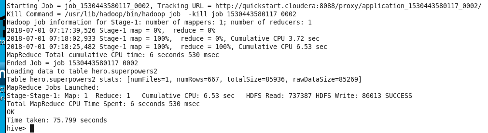

After we done creating all the tables and we have to combine all of it in single table for faster time search because of this we create finalsuper table:

```HiveQL
CREATE TABLE finalsuper (
	id INT,
	name STRING,
	gender STRING,
	race STRING,
	color STRUCT<hair: STRING,
		eye:STRING,
		skin:STRING>,
	size STRUCT<height:FLOAT,
		weight:FLOAT>,
	publisher STRING,
	alignment STRING,
	powers ARRAY<STRING>
) ROW FORMAT DELIMITED
FIELDS TERMINATED BY '\t'
COLLECTION ITEMS TERMINATED BY ',';
```

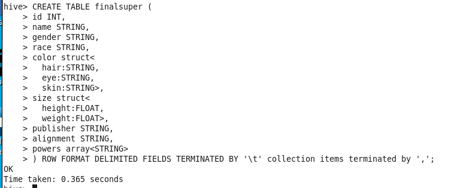

Then describe the table:

```HiveQL
DESCRIBE finalsuper;
```

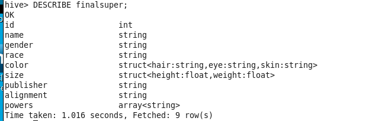

Then insert all the data from the `superheros2` and `superpowers2` to `finalsuper` table:

```HiveQL
INSERT INTO TABLE finalsuper
SELECT superheros2.*, superpowers2.powers
FROM superheros2
JOIN superpowers2 ON superheros2.name = superpowers2.name;
```

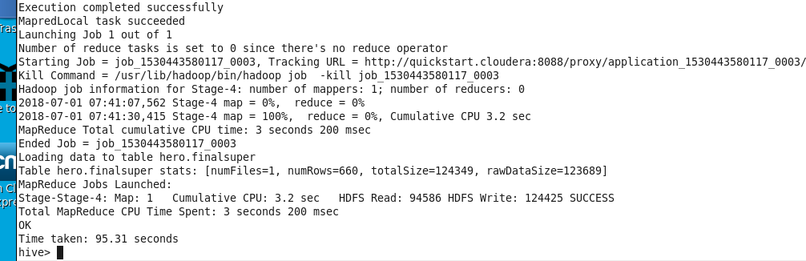

### 10 Intuitive Questions

1. Find all male superheroes:

	```HiveQL
	SELECT name FROM finalsuper WHERE gender='Male';
	```

	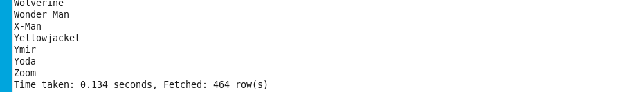

2. Find all superheroes with brown eyes:

	```HiveQL
	SELECT name FROM finalsuper WHERE color.eye ='brown';
	```

	

3. The total number of publishers:

	```HiveQL
	SELECT COUNT(DISTINCT publisher) FROM finalsuper;
	```

	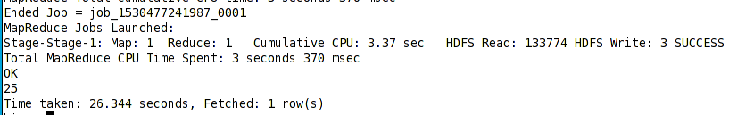

4. Find all bald superheroes:

	```HiveQL
	SELECT name FROM finalsuper WHERE race = 'Human' AND color.hair = 'No Hair';
	```

	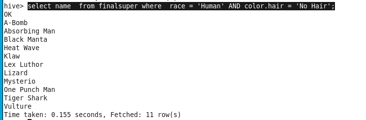

5. Find all superheroes whose name starts with 'Y':

	```HiveQL
	SELECT name FROM finalsuper WHERE name LIKE 'Y%';
	```

	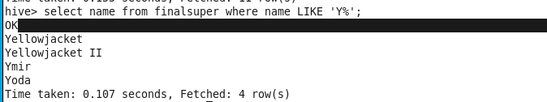

6. Show Abraxas's powers:

	```HiveQL
	SELECT powers FROM finalsuper WHERE name = 'Abraxas';
	```

	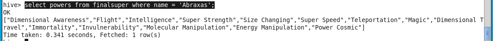

7. Find the most common alignment:

	```HiveQL
	SELECT alignment, COUNT(*) total FROM finalsuper GROUP BY alignment ORDER BY total DESC LIMIT 1;
	```

	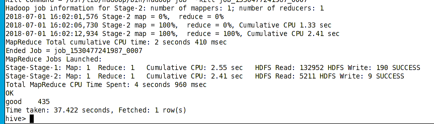

8. Find Human superheroes that have a negative weight:

	```HiveQL
	SELECT name FROM finalsuper WHERE race = 'Human' AND size.weight < 0;
	```

	

9. Find superheroes whose height is between 0 and 100:

	```HiveQL
	SELECT name FROM finalsuper WHERE size.height BETWEEN 0 AND 100;
	```

	

10. How many female superheroes are good or bad:

	```HiveQL
	SELECT COUNT(*) FROM finalsuper WHERE gender = 'Female' AND (alignment = 'good' OR alignment = 'bad');
	```

	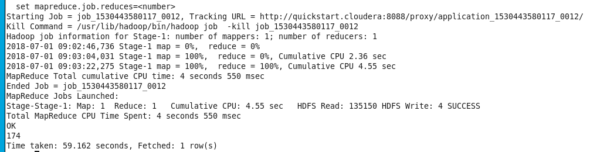


##Part 2: SOLR USE-CASE

We will interface with Solr using the Terminal and a Web Browser. The Terminal command we will use is:

```Shell
solrctl
```

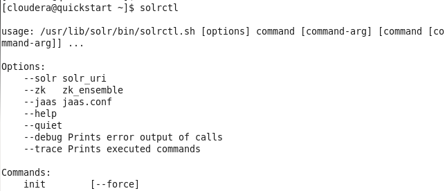

We will need to create a custom schema to work with our [sample data](https://www.briandunning.com/sample-data/).

To begin, generate the configuration for the lab2 core:

```Shell
solrctl instancedir --generate $HOME/configurationLab2
```


You will find the generated directory in your home folder:

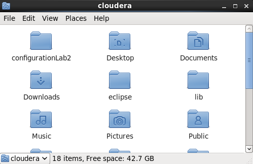


Using the File System UI, Go to `home > configurationLab2 > conf` and open `schema.xml` with `gedit`.

Or, from the Terminal execute this command to perform the same task:

```Shell
gedit ~/configurationLab2/conf/schema.xml
```

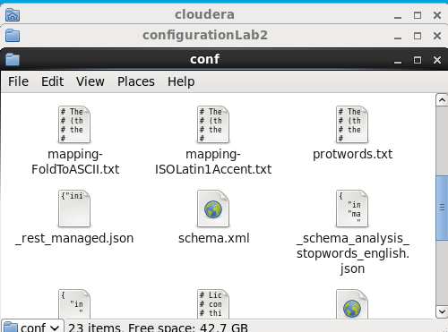

Replace the contents of the `schema.xml` file with the `schema.xml` file in the Lab2 folder.

The `schema.xml` file in the Lab2 folder contains field definitions to properly handle the dataset.

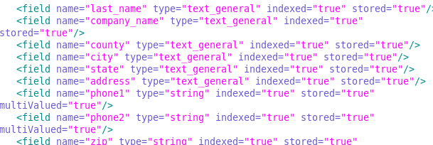

Additionally, the uniqueKey is specified as the email column.

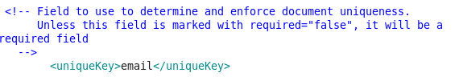


Save the modified Scheme, and from Terminal, load the `lab2` configuration.

```Shell
solrctl instancedir --create lab2 $HOME/configurationLab2
```


Finally, create the `lab2` collection.

```Shell
solrctl collection --create lab2
```

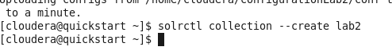

We are now done with the Terminal, the remaining work will be done with the Web Browser.

Navigate to the `Solr Admin` by using this link http://quickstart.cloudera:8983/solr/#/


Import the dataset into the newly created core:

- Choose `lab2_shard1_replica1` from the `Core Selector` drop down.
- Navigate to the `Documents` section.
- Set the `Document Type` to `CSV`

	

- Paste the contents of `us-500.csv` into the `Document(s)` text area.
- Click the `Submit Document` button.
	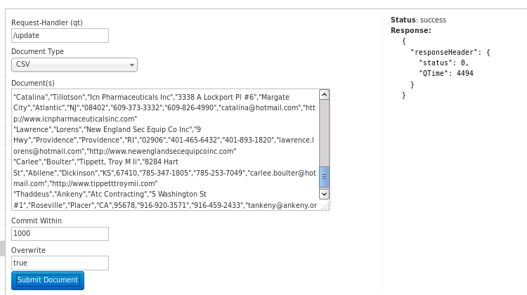

We can now perform queries against or dataset. Navigate to the `Query` page to begin.

### 5 Nested Queries and QTime for Each

1. Where `state` is `LA` with nested query where `city` is `New Orleans` (QTime: 406):

	```
	state:LA AND _query_:"city: New Orleans"
	```

	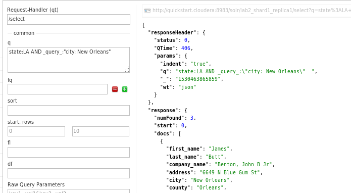

2. Where city is `New York` with nested query where `company_name` ends with `inc` (QTime: 319):

	```
	city:"New York" AND _query_:"company_name:*inc"
	```

	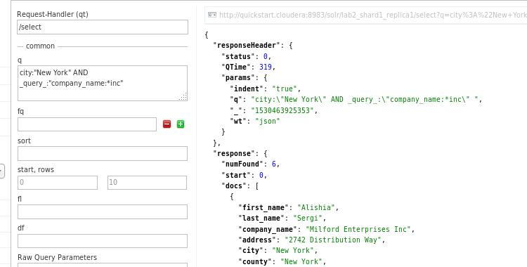

3. Where `first_name` starts with `Jo` with nested query where `state` is `CA` (QTime: 34):

	```
	first_name:Jo* AND _query_:"state:CA"
	```

	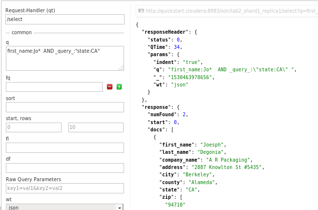

4. Where `city` is `Abilene` with nested query where `state` is `KS` or `TX` (QTime: 6):

	```
	city:Abilene AND _query_:"state:KS OR state:TX"
	```

	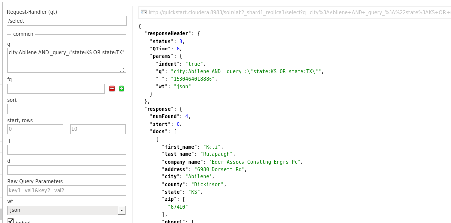

5. Where `city` is `Baltimore` with nested query where `zip` starts with `2121` (QTime: 6):

	```
	city:Baltimore AND _query_:"zip:2121*"
	```

	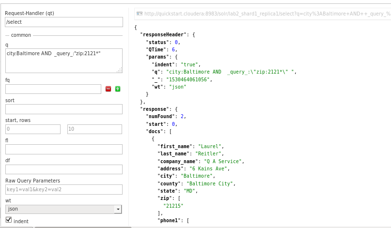

### 5 Simple Queries and QTime for Each

1. Where `email` does not end with `.com` (QTime: 247):

	```
	-email:*.com
	```

	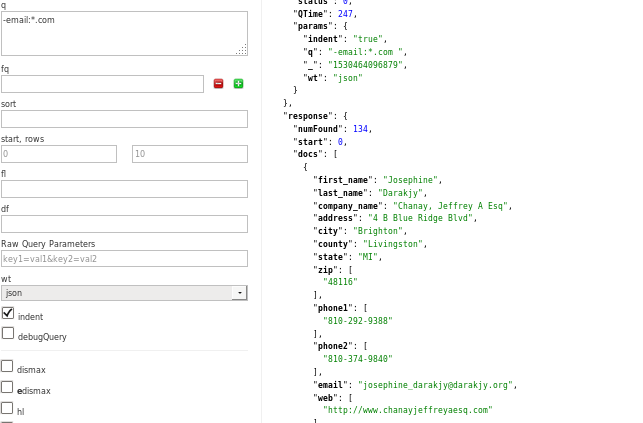

2. Where either `phone1` or `phone2` starts with `913-` (QTime: 10):

	```
	phone1:913-* OR phone2:913-*
	```

	

3. Where `address` ends with `st` (QTime: 36):

	```
	address:*st "QTime": 36
	```

	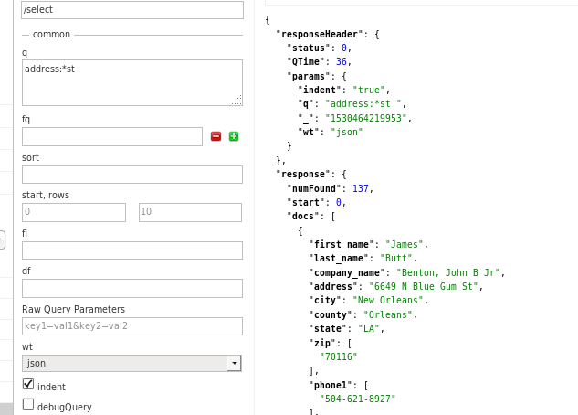

4. Where `first_name` is `Dalene` (QTime: 2):

	```
	first_name:Dalene "QTime": 2
	```

	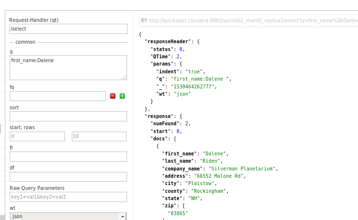

5. Where `city` is `Abilene` (QTime: 1):

	```
	city:Abilene
	```

	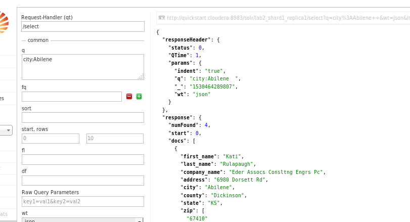
